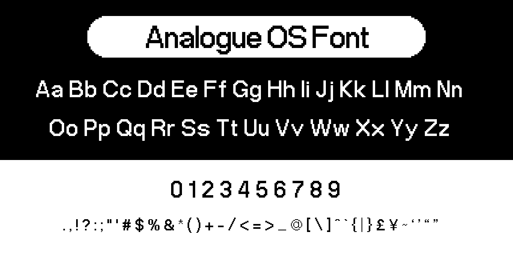

# Analogue OS Font



## About

This is my attempt at recreating the font used in Analogue OS on the Analogue Pocket device. The original font was designed by [Analogue Inc.](https://www.analogue.co/), and I do not claim any ownership of it. This is simply a recreation for personal use. The repository has been created as a way to share my recreation of the font with the public.

Feel free to use this font in any way you see fit. If you do use it, I would appreciate a credit in the form of a link to this repository.

I am not affiliated with Analogue Inc. in any way.

## Live demo
See a recreation of Analogue Pocket's home screen using HTML and CSS [here](https://abfarid.github.io/analogue-os-font/).

## Download

`.ttf`, `.otf` and `woff/2` files can be downloaded from the [`/dist`](https://github.com/AbFarid/analogue-os-font/tree/master/dist) folder or from the [Releases](https://github.com/AbFarid/analogue-os-font/releases/) page.

## Source

Files included in the [`/src`](https://github.com/AbFarid/analogue-os-font/tree/master/src) folder:
- all the individual character `svg`s
- `.vfc` (FontLab 8) project file
- `.ufo` file (exported from FontLab)
- `.afdesign` (Affinity Desgner 1.10) files

## How to use

### In word processors
Download the `.otf` or `.ttf` file and install it.

### In web pages
1. Download the `.woff` and `.woff2` files and copy them to your project.
2. Add the following CSS, but replace the font path with your own:
```css
@font-face {
  font-family: 'Analogue';
  src: url('assets/AnalogueOS-Regular.woff2') format('woff2'),
       url('assets/AnalogueOS-Regular.woff') format('woff');
  font-weight: normal;
  font-style: normal;
}
```
3. Use like any other font: `font-family: Analogue, sans-serif;`
